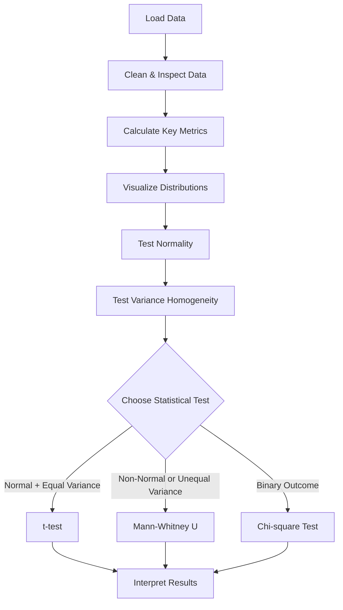

# Dating App A/B Testing Analysis

This repository contains a comprehensive A/B test analysis of a new matching algorithm implemented in a dating application. The goal was to evaluate whether the new algorithm improves user engagement and matching efficiency compared to the existing version.

---

## 📊 Project Overview

A new profile-matching algorithm was tested via an A/B experiment. Users were randomly split into control (existing algorithm) and test (new algorithm) groups. The study analyzes user interaction logs to assess the algorithm's impact on key business metrics.

---

## 📊 A/B Test Statistical Analysis Flow

This project includes the full workflow for analyzing A/B test data, including sanity checks, assumptions validation, and appropriate test selection.

---

## 🔍 Key Findings

- **+103%** increase in average user actions (likes/views)
- **+107%** improvement in user-level match conversion rate
- **+106%** improvement in overall (aggregate) match rate
- Results are statistically significant (**p < 0.001**) across all key metrics

---

## 🧪 Methodology

### Metrics Analyzed
- **User engagement**: Average actions per user (likes/views)
- **Conversion rate**: Match-to-action ratio (per user and per group)
- **Group-level match rate**

### Statistical Tests
- Normality check: Shapiro-Wilk test
- Variance check: Levene’s test
- Hypothesis testing: Independent t-tests and Chi-square tests
- Significance threshold: α = 0.05

### Tools & Libraries
- Python (pandas, NumPy)
- Visuals: Matplotlib, Seaborn
- Statistical analysis: SciPy, Pingouin
- Version control: Git

---

## 📈 Results Summary

| Metric                | Control Group | Test Group | Improvement |  
|-----------------------|---------------|------------|-------------|  
| Average Actions/User  | 9.56          | 19.48      | +103.6%     |  
| Match Conversion Rate | 19.41%        | 40.23%     | +107.3%     |  
| Overall Match Rate    | 19.50%        | 40.20%     | +106.2%     |  

---

## 💡 Recommendations

- Deploy the new matching algorithm to 100% of users.
- Monitor long-term retention and premium conversion impact.
- Consider follow-up experiments for further optimization.

---

## 📘 Full Analysis Notebook

For a comprehensive, step-by-step analysis of the A/B testing case, including data exploration, visualization, hypothesis testing, and final recommendations, please refer to the full Jupyter Notebook:

**👉 [Dating_Application_A/B_Tests.ipynb](Dating_Application_A/B_Tests.ipynb)**

This notebook presents:

- A real-world scenario simulating an online dating application's algorithm evaluation.
- Well-defined business metrics (user actions, conversion rates).
- Data visualization to illustrate group differences.
- Hypothesis formulation and statistical tests (t-test, chi-squared).
- Clear, data-driven conclusions on the effectiveness of the new matching algorithm.